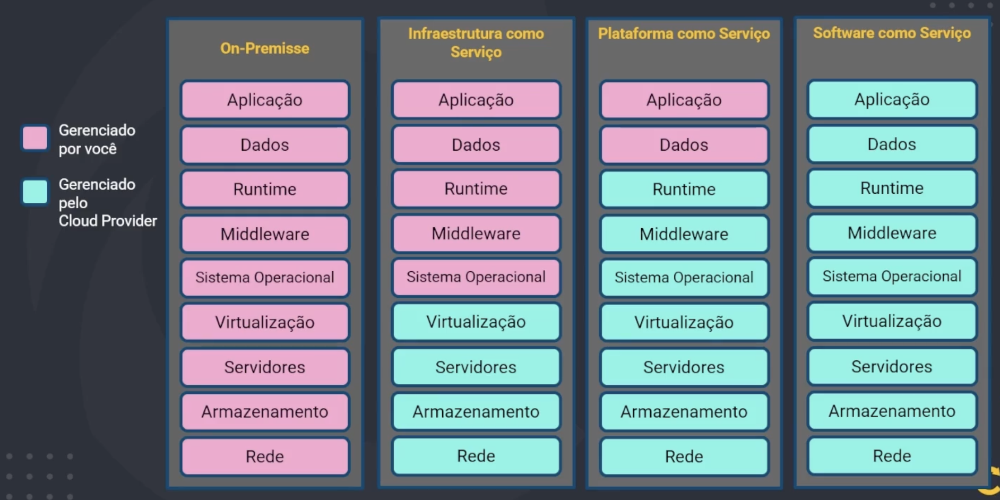

# Cloud Providers

Cloud computing is a technology that allows users to access and store data, run applications, and perform various computing tasks over the internet rather than on local servers or personal computers. It provides on-demand access to a shared pool of configurable computing resources, such as servers, storage, databases, and software, which can be rapidly provisioned and released with minimal management effort. This model offers scalability, flexibility, cost efficiency, and the ability to access services from anywhere with an internet connection.

